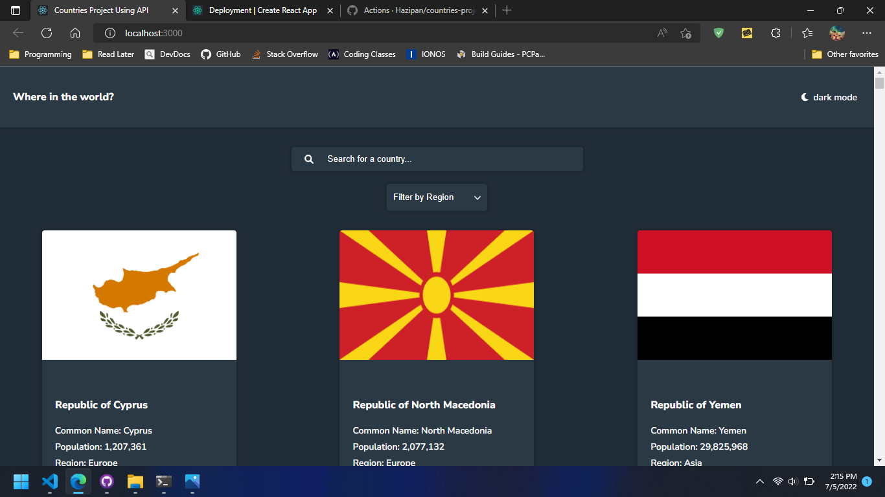

# Frontend Mentor - REST Countries API with color theme switcher solution

This is a solution to the [REST Countries API with color theme switcher challenge on Frontend Mentor](https://www.frontendmentor.io/challenges/rest-countries-api-with-color-theme-switcher-5cacc469fec04111f7b848ca). Frontend Mentor challenges help you improve your coding skills by building realistic projects. 

## Table of contents

- [Overview](#overview)
  - [The challenge](#the-challenge)
  - [Screenshot](#screenshot)
  - [Links](#links)
- [My process](#my-process)
  - [Built with](#built-with)
  - [What I learned](#what-i-learned)
  - [Continued development](#continued-development)
  - [Useful resources](#useful-resources)
- [Author](#author)

## Overview

### The challenge

Users should be able to:

- See all countries from the API on the homepage
- Search for a country using an `input` field
- Filter countries by region
- Click on a country to see more detailed information on a separate page
- Click through to the border countries on the detail page
- Toggle the color scheme between light and dark mode *(optional)*

### Screenshot

### Links

- Solution URL: [https://www.frontendmentor.io/solutions/countries-project-using-react-drI7V6-XjO](https://www.frontendmentor.io/solutions/countries-project-using-react-drI7V6-XjO)
- Live Site URL: [https://hazipan.github.io/countries-project-using-api/](https://hazipan.github.io/countries-project-using-api/)

## My process

### Built with

- Semantic HTML5 markup
- CSS custom properties
- Flexbox
- CSS Grid
- Mobile-first workflow
- [React](https://reactjs.org/) - JS library

### What I learned

This project was really cool. I've always wondered how to make requests to servers and this was the first step to integrating backend technology with my projects! I also learned a learned an important difference between class components and hooks. Class components have lifecycle methods, but hooked components don't. The useEffect method is all the lifecycle methods combined. Interesting stuff.

### Continued development

From here I'm going to build a few more project (at least one of which will also include an API), then I'm going to transition my learning to the backend! I'm really excited to start learning about servers and data bases.

## Author

- Github - [Hazipan](https://github.com/Hazipan)
- Frontend Mentor - [@Haziapn](https://www.frontendmentor.io/profile/hazipan)
